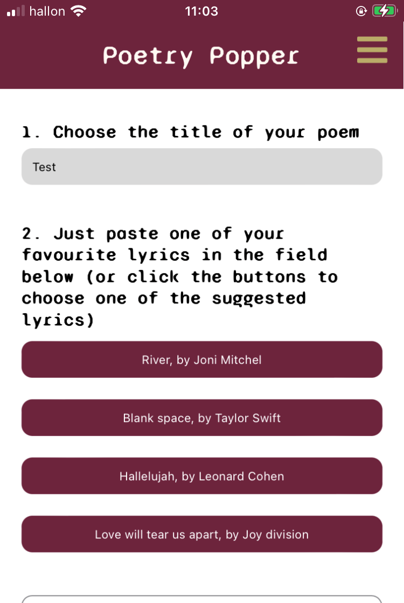
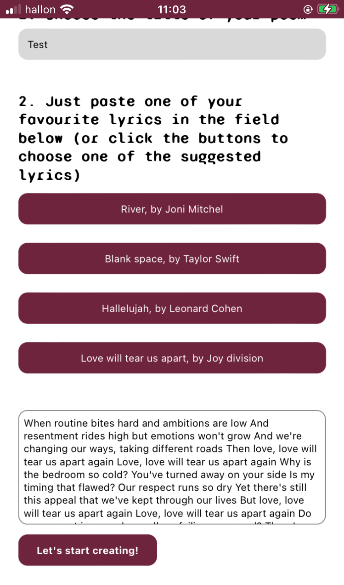
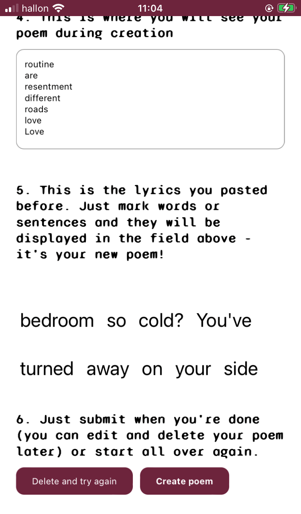
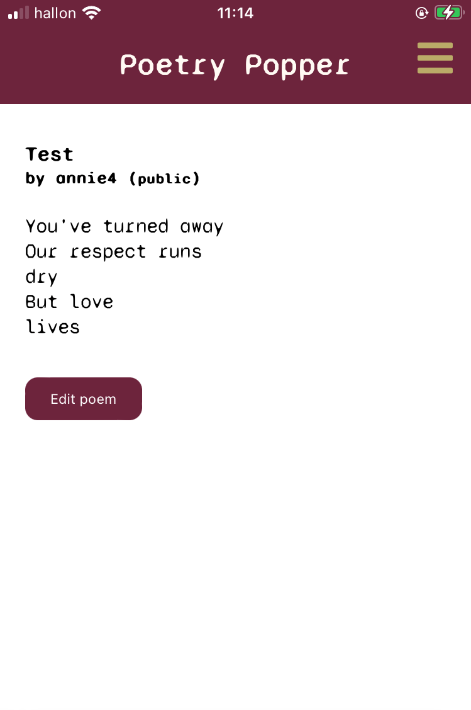
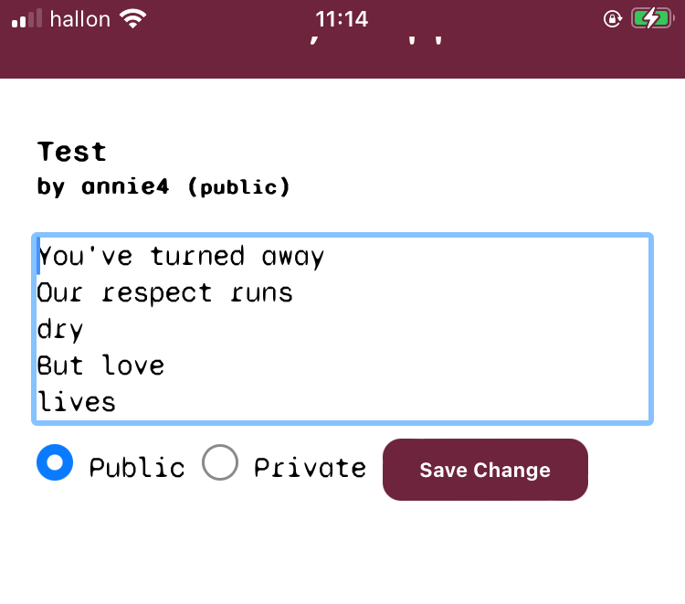

# poetryPopper2.0

# INTRODUCTION
Poetry popper är en typ av textredigeringsapplikation som kan fungera som ett verktyg i skapande av dikter, lyrik, låttexter etc. Genom att använda sig av redan befintliga texter (tex en låttext) kan man markera ord och meningar och på så sätt skapa nya texter. 

# REQUIREMENTS & INSTALLATION
1. Besök https://github.com/annieembrink/poetryPopper2.0
2. Tryck på knappen "Code" och välj att kopiera adressen som är HTTPS
3. Öppna VS code
4. Öppna den mapp dit du vill clona ner repot
5. Öppna terminalen i VS code genom att trycka ctrl + ö
6. Skriv git clone https://github.com/annieembrink/poetryPopper2.0.git
7. Skriv cd poetryPopper2.0 i terminalen
8. Skriv npm install i terminalen
9. Starta appen genom att skriva npm run dev i terminalen
10. Gå in på localhost:3000 i din webbläsare för att se applikationen

# ANVÄND APPEN
1. Välj titel  

2. Klistra in text som redan finns  

3. Markera orden du vill ha i din nya dikt  

4. Här visas den färdiga dikten  

5. Ändra vid behov  
